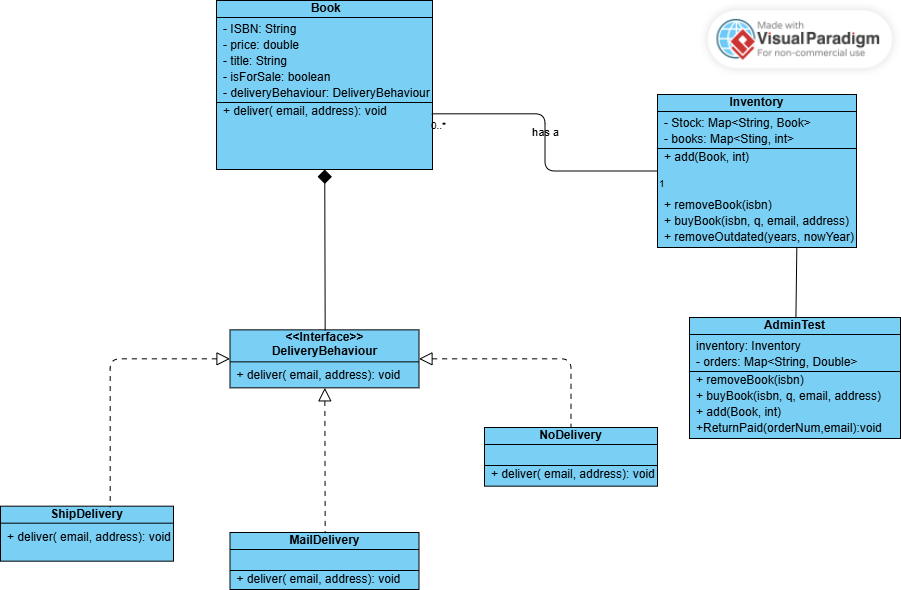

# Quantum Book Store

This project is a simple Java-based system that simulates an extensible online bookstore. It handles inventory management, book purchasing, and delivery logic using OOP and Design Patterns.

## Features

- Add books to the inventory
- Remove outdated books based on publish year
- Buy books using ISBN, quantity, email, and address
- deliver books via email or shipping
- Track orders and return paid amounts
- Designed for easy extensibility with new book types or delivery methods

## Main Components

- `Book`: Holds core book details like ISBN, title, year, price, and delivery behavior
- `DeliveryStrategy`: Interface for delivery behavior (e.g., shipping, email, none)
- `Inventory`: Manages books and their stock
- `Admin`: Handles operations like adding books, placing orders, and refunds
- `Main`: Runs a demo of the system

## Class Diagram



## Sample Output


## Running the Project

Compile all Java files:

```bash
javac *.java
```

Run the test class:

```bash
java QuantumBookstoreFullTest
```

## Requirements

- Java 8 or higher
- No external libraries
